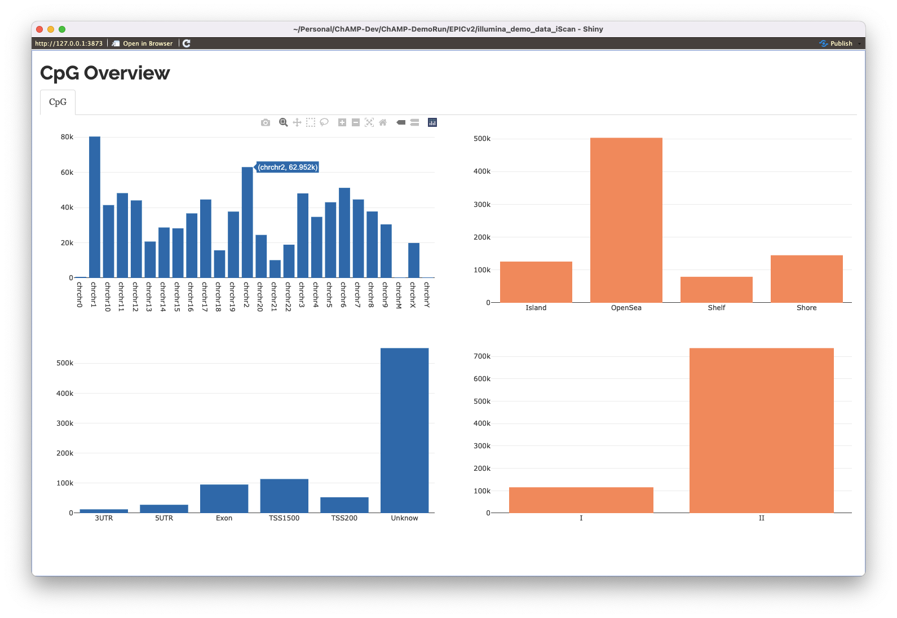
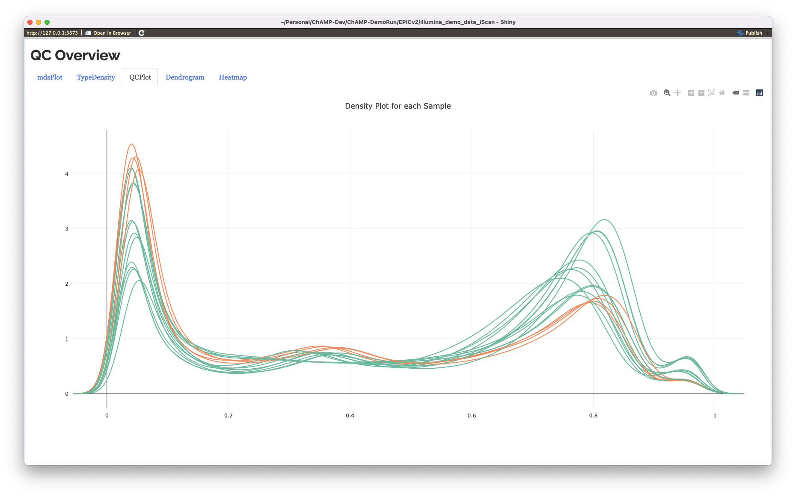
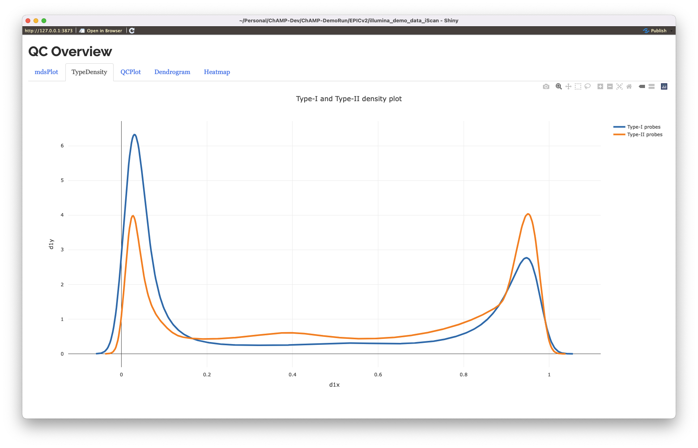
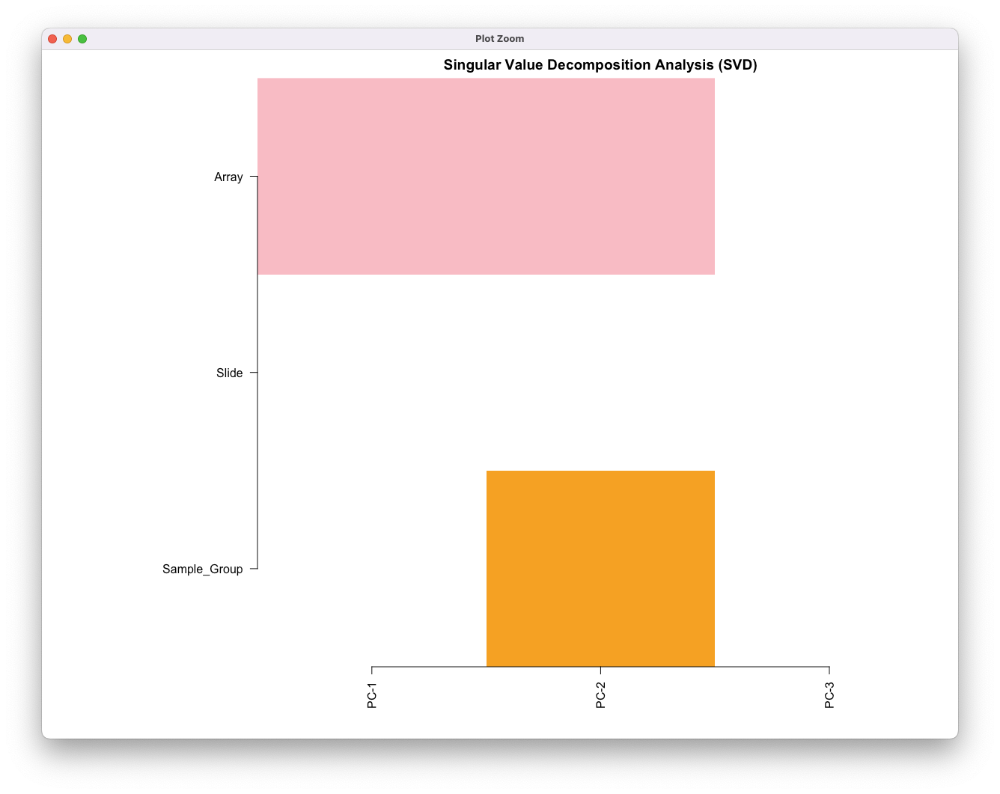
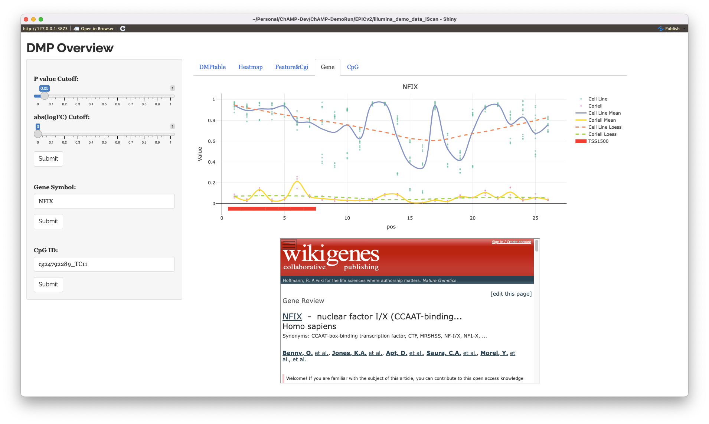
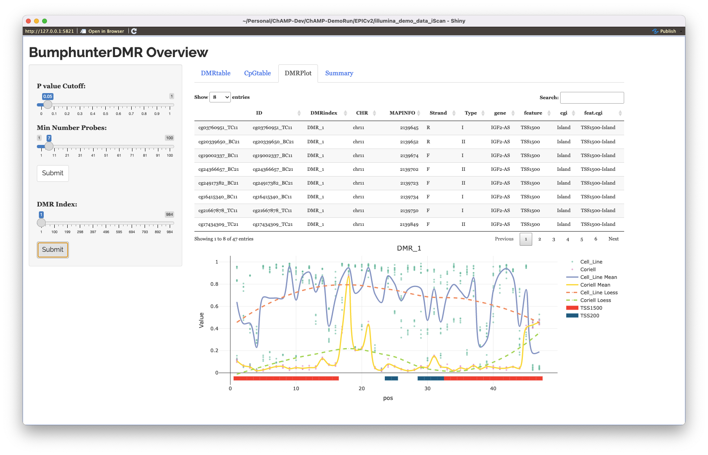

illumina EPICv2 iScan Demo
================
Yuan Tian (<champ450K@gmail.com>)
22 February, 2023

This is a run markdown for ChAMP supporting on illumina HumanMethylation
EPICv2 array. To replicate this run, you need to install the ChAMPdata
(\>=2.31.1), and ChAMP version \>= 2.29.1. The latest ChAMPdata can be
obtained [here](https://github.com/YuanTian1991/ChAMPdata). And the
latest ChAMP is [here](https://github.com/YuanTian1991/ChAMP).

To install ChAMP 2.29.1. In shell:

``` bash
git clone https://github.com/YuanTian1991/ChAMP.git
R CMD INSTALL ChAMP
```

Then install ChAMPdata 2.23.1:

``` bash
git clone https://github.com/YuanTian1991/ChAMPdata.git
R CMD INSTALL ChAMPdata
```

In this demo, I am using the default iScan one [demo data provided by
illumina](https://emea.support.illumina.com/array/array_kits/infinium-methylationepic-beadchip-kit/downloads.html).

``` r
library("ChAMP")
```

After the above library loading, you can check library version with
`sessionInfo()`.

## 1. Import IDAT Data

Like previous version, ChAMP requires only one CSV to be put in a
folder, along with IDAT files to be loaded.

``` r
myImport <- champ.import("./DemoDataEPICv2/", arraytype = "EPICv2") # This can also be set just as `EPIC`
```

## 2. Filtering

After loading, filtering will be done, specifically, the SNP mask is
using the one provided by Zhou
[here](http://zwdzwd.github.io/InfiniumAnnotation).

``` r
myFilter <- champ.filter(beta=myImport$beta, 
                         pd=myImport$pd, 
                         detP=myImport$detP,
                         beadcount=myImport$beadcount, 
                         ProbeCutoff=0.1,
                         arraytype = "EPICv2") # This can also be set just as `EPIC`
```

Below example shows if you need to do population-specific filtering.
Currently, EPICv2 annotation only support AFR, AMR, EAS, EUR and SAS.

``` r
myFilter <- champ.filter(beta=myImport$beta, 
                         pd=myImport$pd, 
                         detP=myImport$detP,
                         beadcount=myImport$beadcount,
                         population="EUR",
                         arraytype = "EPICv2") # This can also be set just as `EPIC`
```

## 3. Loading

Above two step can be merged into just one `champ.load()`. The defaul
champ.load have two method: `ChAMP` or `minfi`, currently minfi package
is not working for EPICv2, so only `ChAMP` works here.

``` r
myLoad <- champ.load("./DemoDataEPICv2/", arraytype = "EPICv2")
```

## 4. CpG.GUI

Then, we can use CpG.GUI() to explore a beta matrix, along with a vector
of phenotype.

``` r
CpG.GUI(rownames(myLoad$beta), arraytype = "EPICv2")
```



## 5. QC

QC.GUI() can be used for check beta matrix

``` r
QC.GUI(beta=myLoad$beta, pheno = myLoad$pd$Sample_Group, arraytype = "EPICv2")
```



Also, champ.QC() function works, but I mostly only use QC.GUI() above.

``` r
champ.QC(beta = myLoad$beta, pheno = myLoad$pd$Sample_Group)
```

## 6. Normalisation

Since minfi is not working now, currently, champ.norm() only support
`BMIQ` and `PBC` method. `SWAN` and `FunctionalNormalisation` is not
working for now.

``` r
# I recommand BMIQ, which ONLY works for beta matrix.
myNorm <- champ.norm(myLoad$beta, method = "BMIQ", arraytype = "EPICv2")

# or PBC
myNorm <- champ.norm(myLoad$beta, method = "PBC", arraytype = "EPICv2")
```

Below is the normalised data from QC.GUI()

``` r
QC.GUI(beta=myNorm, pheno = myLoad$pd$Sample_Group, arraytype = "EPICv2")
```



## 7. SVD Check

Than champ.SVD() should be used to check confounding effect.

``` r
champ.SVD(myNorm, pd = myLoad$pd)
```



The result shows there are confounding effect for Array, so I want to
adjust it with Combat.

## 8. Combat Batch Effect Adjustment

Below code works for batch correction, but I do admit that current
champ.runCombat() need to improve and failed constantly. A better method
(maybe scBatch?) need to be incoprated.

``` r
myCombat <- champ.runCombat(beta=myNorm,pd=myLoad$pd,batchname=c("Array"))
```

## 9. DMP and GUI

Finally, below is the EWAS analysis, firstly do DMP analysis.

``` r
# Below code exist because the origin sample group contains space, replace it with `_` works.
tmp_pheno <- myLoad$pd$Sample_Group
tmp_pheno <- gsub(" ", "_", tmp_pheno)

myDMP <- champ.DMP(beta = myNorm,pheno=tmp_pheno, arraytype = "EPICv2")
```

Then, CpG.GUI() can be used to check the DMP result:

``` r
DMP.GUI(DMP=myDMP[[1]], beta=myNorm, pheno=myLoad$pd$Sample_Group)
```

It works nicely.



## 10. DMR and GUI

This is a challenge part. Firstly I believe `ProbeLasso` and `DMRcate`
is not working, the formal requires a special king of old annotation,
which I have not generated (but I don’t want to use the old format
anymore, so I will change the code to fit new annotation). DMRcate
package can’t be install on my computer…Like some user complained, I
don’t know why yet.

So, the `Bumphunter` is the only choice here for DMR. Actually this is
the one I recommand.

``` r
myDMR <- champ.DMR(beta=myNorm, 
                   pheno=tmp_pheno,
                   method="Bumphunter", # Don't use othe method, only Bumphunter works.
                   arraytype = "EPICv2", 
                   cores=10)
```

Below is the DMP.GUI

``` r
DMR.GUI(DMR=myDMR, beta=myNorm, pheno=tmp_pheno, arraytype = "EPICv2")
```



It works well, just a bit slow, I should accelerate it a bit with
data.table….

## 11. Block and GUI

Similar as DMR, Block should works:

``` r
myBlock <- champ.Block(beta=myNorm, pheno = tmp_pheno, arraytype = "EPICv2")
```

Block.GUI is not working for now.

## 12. GSEA

The GSEA will take DMP and DMR result with various GO enrichment method.
Neither `gometh` nor `ebayes` method currently is not working, only
`fisher` works.

``` r
myGSEA <- champ.GSEA(beta=myNorm,
                     DMP=myDMP[[1]], 
                     DMR=myDMR,
                     pheno=tmp_pheno,
                     arraytype="EPICv2",
                     adjPval=0.05, 
                     method="fisher")
```

gometh is not supporting because it’s a method from missMethyl package,
which is also outdated seems. ebGSEA does not support because globaltest
failed, I don’t know why yet…

# 13. Refbase Cell Type Adjustment

Refbase function works for EPICv2.

``` r
myRefBase <- champ.refbase(beta=as.data.frame(myNorm) ,arraytype="EPICv2")
```

# 14. CNA

This function need to improve a bit, which is not working now.
